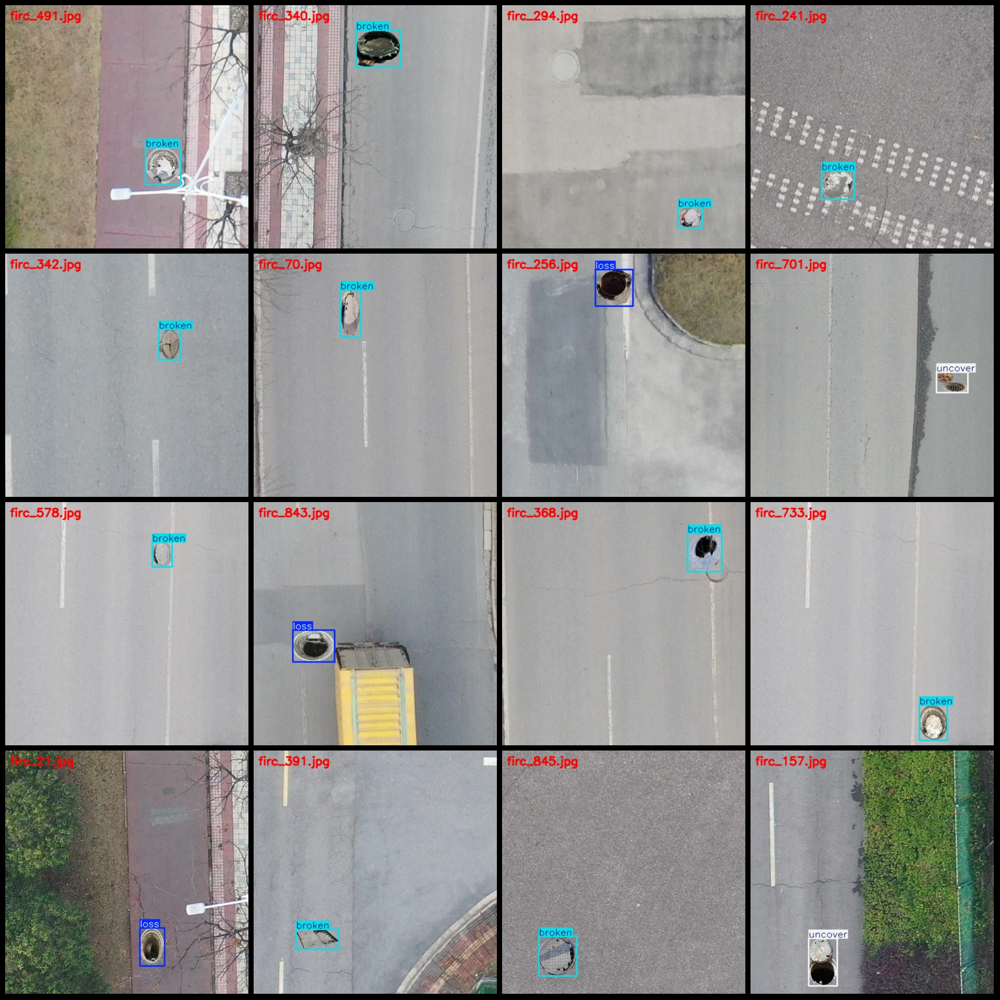

# Drone Perspective Intelligent Traffic Road Pavement Manhole Abnormal Loss or Damage Not Covered Detection Data Set - VOC+YOLO Format - 851 Images in 3 Categories

Please note that the dataset consists of synthetic images. For specifics, please refer to the images.
Dataset format: Pascal VOC format + YOLO format (without the split path in the txt file, only containing jpg images along with corresponding VOC format xml files and YOLO format txt files).
Number of images (jpg file count): 851
Number of annotations (xml file count): 851
Number of annotations (txt file count): 851
Number of annotation categories: 3
Annotation category names (Note that the order of labels in the YOLO format does not correspond to this, but is based on the labels folder classes.txt): ["broken", "loss", "uncover"]
Number of bounding boxes per category:
- broken (Manhole Broken) = 563
- loss (Manhole Lost) = 193
- uncover (Manhole Uncovered) = 102
Total bounding boxes: 858
Number of images per category:
- broken (Broken Manhole) = 559
- loss (Lost Manhole) = 193
- uncover (Uncovered Manhole) = 102
Resolution of images: 512x512
Using annotation tool: labelImg
Annotation rules: Draw bounding boxes for each category
Important notice: The dataset does not have a division into training, validation, and test sets; you need to divide them yourself.
Special declaration: This dataset does not guarantee any accuracy of the trained model or weight files.
Image preview:
Annotation examples:

## Images

Here is a pay link on Stripe ( https://buy.stripe.com/3cs8yP7sY87d0vu9AB ). Please contact me lonlonago@foxmail.com after funding $89, and I will send you a complete data files , thank you!

